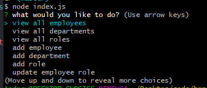

# Employee-Tracker

The purpose of this back end Node.js application is to be able to hold a database of employees and query the database to display the employees, roles, and departments. Also, the user is able to add, update, and delete employees from the database as needed.

## Instructions

<code>npm i</code>

<code>node index.js</code>

